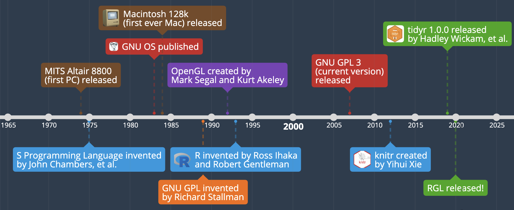

```{r setup, include=FALSE}
knitr::opts_chunk$set(echo = FALSE, warning = FALSE, error = FALSE, message = FALSE, cache = TRUE)
```

```{r}
#install.packages("rgl")
#install.packages("zoo")
#install.packages("magick")
#install.packages("prettydoc")
library(tidyverse)
library(knitr)
library(zoo)
library(rgl)
PI = 3.14159265359
knitr::knit_hooks$set(webgl = hook_webgl)
```

### **Package Overview**

####Summary
Data visualization is a key component to understanding and communicating about data. Interactive graphs allow the user to dive deeper, making it easier to detect patterns, trends and outliers. A shortcoming of the current version of R is the lack of sophisticated methods for 3D visualization. This is the goal of the R package rgl.

rgl produces interactive, real-time 3D plots using medium and higher level functions. rgl was created in order to provide an easier way to create 3D models using R. It has several advanced features that other 3D plotting packages do not contain, which we will cover later.

##### The rgl package functionality can be divided up into a couple key elements {.tabset}

###### OpenGL Backend
rgl is powered by the non-profit-owned, open-source OpenGL (Open Graphics Library) API (Application Program Interface), which is a cross-platform, hardware-independent interface (display driver) for rendering 2D and 3D vector graphics. OpenGL is a HAL (Hardware Abstraction Layer), which means it translates information to and from the hardware (in this case graphic processing) to higher level software like R.

It cannot be downloaded as it is implemented by manufacturers in the computer's graphics card. It exists on most operating systems. OpenGL was implemented in rgl instead of its main competitor, Direct3D, likely because OpenGL is nonproprietary and is seen as slightly more efficient.


###### High-level Graphics
Since OpenGL was first released in 1992, it has been historically been implemented in lower level programming languages like C or C++. Therefore, rgl works with OpenGL via a wrapper class that translates the machine readable code of OpenGl to R. By allowing for R to be used with OpenGL, R programmers can unleash the full functionality of OpenGL from the comfort and high-level functionality of the R programming language (R is a high-level language because it is an interpreted language as opposed to a compiled language, meaning the R interpreter must convert the R programming into machine-readable code).

One potential downside, however, is that, while OpenGL *can* be implemented entirely in software, it is designed to be implemented entirely or at least mostly in hardware. rgl's differentiator - the use of a wrapper class on the OpenGL API - is very taxing on processing power because it essentially creates a software extension of OpenGL, which is intended to live on hardware. The combination of the additional subroutine along with the inefficiencies of an off-harddrive OpenGl extention combine to exacerbate the the computer's already tough job of generating a complex 3D plot.

High level graphics that rgl can render include 3D histograms with hist3d, 3D perspective plots with persp3d, and 3D scatterplots with plot3d. The creation of high-level, sophisticated graphics like those aforementioned was ultimately the reason that rgl was created.



###### Low-level structure
rgl's structure is inspired by but does not implement the grid package. rgl therefore implements same primitive graphical element functionality fundamental to ggplot2. So, just as ggplot2 creates geoms and the grid package creates grobs that allow the user to implement and layer simple graphical elements, rgl creates its own simple graphical elements in 3D space that will proceed to become part of high-level graphics. Low level graphics that rgl can render on in a 3D space include points with points3d, lines with lines3d, fill triangles with triangles3d, and filled quadrilaterals with quads3d.


#### Background
rgl was published on April 14th of this year after a few years of development by a team of a dozen researchers led by German software developer Daniel Adler and Canadian statistics professor Duncan Murdoch. rgl is licensed on a GNU GPL (General Public License), a project launched in 1983 designed to ensure that the software remains free to use for the entire public in contrast to a traditional software license with the opposite purpose.

##### Version History
Current Version: 0.100.54. This is the only version available and was published 4/14/20.

##### Dependencies
R (≥ 3.2.0)

##### Usage
rgl essentially allows for the equivalent 3d functions of classic 2d R graphics to be created easily thanks to similar syntax. For example, rgl has plot3d, hist3d and persp3d, analogous to traditional R's plot, hist, and persp functions. As stated earlier, rgl leverages an OpenGL backend in order to offer superior graphics optionality. Ultimately, as we will see, the menu for 3D graphic R packages isn't incredible, and rgl offers the greatest customizability of all 3D graphics packages in R through its display driver wrapper and low-level structure to create high-level graphics.  


### **Examples of Usage**

#### **Main Functions**

At the most basic level, the functions within RGL can be classified into 6 categories: 

1. Device Management Functions
  + rgl.open()
  + rgl.close()
2. Scene management functions
  + rgl.clear("shapes") - removes all the shapes from the scene
3. Export functions
  + rgl.snapshot(filename)
  + writeWebGL() - creates a webpage for interactive plot
  + rglwidget() - allows you to create an interactive plot within RMD files
4. Shape functions
  + rgl.lines(x,y,z)
  + rgl.spheres(x,y,z)
  + rgl.cylinder(x,y,z)
  + rgl.quads(x,y,z)
  + surface.3d(x,y,z)
  + persp3d.(x,y,z)
  + spin3d(x,y,z)
  + play(3d)
  + and more
5. Environment functions
  + rgl.viewpoint(theta,phi,zoom)
  + rgl.bg3d()

##### **Points and Spheres**{.tabset}

At the most basic level, we can create 3d scatterplots and overlay some planes. But first, we need to open an rgl device in order to plot. We can then fix our background, change our viewpoint, and finally draw shapes. In order to draw this graph in html output, we need to call the widget: rglwidget()

**(insert graphic here)**

Now we can do some more complex output, leveraging what we just used, but adding in a scatterplot using rgl.spheres(), calculating a regression on two variables, and creating a plane that corresponds to our predicted values for z using surface3d(). Usage of those functions will look something like this:

**(insert graphic here)**

Before we generate our plots, lets create a function that will allow us to customize our preferred setup for these scatterplots and illustrate some more functions:

```{r, echo=TRUE, webgl=TRUE} 
#Want to add my own function for generating axes
rgl_add_axes <- function(x,y,z, axis.col="black", xlab="",ylab="", 
                         zlab="", show.plane=TRUE,show.bbox=FALSE){
  lim <- function(x){c(-max(abs(x)),max(abs(x))*1.1)}
  xlim <- lim(x); ylim<-lim(y); zlim<-lim(z)
  rgl.lines(xlim,c(0,0),c(0,0),color=axis.col)
  rgl.lines(c(0,0),ylim,c(0,0),color=axis.col)
  rgl.lines(c(0,0),c(0,0),zlim,color=axis.col)
  axes <-rbind(c(xlim[2],0,0),c(0,ylim[2],0),c(0,0,zlim[2]))
  rgl.points(axes,color=axis.col,size=2)
  rgl.texts(axes,text=c(xlab,ylab,zlab),color=axis.col, 
            adj = c(0.5,-0.8),size=2)
  if(show.plane){
    xlim <- xlim/1.1; zlim<-zlim /1.1;
    rgl.quads(x=rep(xlim,each=2), y = c(0,0,0,0), 
              z=c(zlim[1],zlim[2],zlim[2],zlim[1]), alpha=0.1)
  }
  
}

```

And here is a 3D scatterplot of European Stock Exchange Daily Percentage Changes from 1990:

**(insert graphic here)**

##### **Surfaces**{.tabset}

We can do more than just create scatterplots, we can also generate complex 3d surfaces. Here we've created some reprentatives of spherical harmonics:

###### Spherical Harmonics (l=4)

**(insert graphic here)**

###### Spherical Harmonics (l=4)

**(insert graphic here)**

###### Spherical Harmonics (l=5)

**(insert graphic here)**


##### **Cylinders and Perspectives**{.tabset}

###### Knots in Space

**(insert graphic here)**

###### Spinning Globe

Using spin3d() and playwidget(), we can also generate animations of our 3d plots: 

**(insert graphic here)**


##### **3D Scatterplot**{.tabset}
We will be putting together many of rgl's main functions to generate a 3D scatterplot from the iris dataset

**(insert graphic here)**


### **Similar Packages** {.tabset}

#### **scatterplot3d**
The most obvious comparison can be drawn between the rgl package and the scatterplot3d package, as this package is used to plot a three dimensional (3D) point cloud perspectively. Scatterplot3d is simple to use and can be easily extended by adding supplementary points or regression planes into an already generated graphic. It is easily installed, as it requires only an installed version of R. Although it is more difficult to plot graphics in rgl, it offers a wider range of features and better aesthetic customization. More subjectively, we think that graphs generated with rgl tend to be more visually appealing than those generated with scatterplot3d.

#### **plotly**
In addition to 3D scatterplots, plotly can create many 3D graphics like rgl. One functionality that rgl offers that plotly does not is orthographic representations of 3D plots, a feature which plotly is currently working towards. Another downside of ploty is that it is actually a company, meaning there is a risk that plotly's owner begins charging programmers for the right to use the plotly software. Plotly does, however, offer a brushing capability that assists the user with tracking down info on individual data points with continuous queries of the closest data point to the mouse. Unfortunately, both plotly and rgl both struggle with large numbers of data points when outputting to html due to high processing power costs.


#### **rayshader**
Another R package comparable to rgl is rayshader, which uses elevation data in base R to generate 2D and 3D topographical visualizations. Rayshader allows the user to employ spherical texture mapping, raytracing, overlays, and even shading via its ambient occlusion effect, as shown in the graphic below. Rayshader additionally allows the user to convert ggplot2 objects into 3D rayshder visualizations. While both rgl and rayshader create 2D and 3D graphics, they ultimately have highly different functionality. Rayshader is clearly intended for creating aesthetically pleasing visuals of essentially 2D areas with vertical topography. Visualizations created with rayshader also have shading under all points, meaning there are no floating elements. Alternatively, rgl can visualize a much greater variety of data sets than raysahder with greater complexity and optionality.


### **Reflection** {.tabset}

The rgl package includes some amazing features that allow you to generate most any 3d plot you can imagine. The interface for creating plots is simple and intuitive. However, the implementation for actually generating the plots can be incredibly frustrating, system dependent, and use far too much memory. When we were knitting our rmd files, we would often get no error messages….and no output. Within rgl, the functions that generate your output won’t work on cloud based systems, so you need to use specific widgets that can tie together the code and the html. You also need to use specific web hooks that must be declared in YAML section of your markdown file, and then declare that your hooks are active in each code chunk in which you want to display any RGL code. This whole process was non-intuitive and was nowhere to be found in the documentation of the package; we had to “knit” together multiple different GitHub support requests to figure out the correct process that would result in an html file being generated by RStudio. 

Rgl’s effectiveness is hindered by the hardware requirements of the html page creation process. If you want to create a simple plot and create a webpage for it, the process is simple. But, if you want to knit those outputs into a singular html file and display the interactive 3D results together, your file will overrun most capacity thresholds….and fail to tell you why the executable failed. Until those problems are fixed, it can be a nightmare to use rgl. 

If they can figure out a way to use less memory when creating plots, or implement a simpler function to create png snapshots, then the utility of the library will be increased tenfold. 

### **Works Consulted**

#### [3D Graphics](http://natverse.org/nat/articles/plotly.html)

#### [Daniel Adler Personal Website](http://neoscientists.org/~plex/)

#### [Duncan Murdoch](https://www.uwo.ca/stats/people/bios/duncan-murdoch.html)

#### [GNU General Public License](https://www.gnu.org/licenses/gpl-3.0.en.html)

#### [Package 'rgl'](https://cran.r-project.org/web/packages/rgl/rgl.pdf)

#### R Graphics Cookbook - Winston Chang

#### [rayshader](https://www.rayshader.com/#:~:text=Overview,topographic%202D%20and%203D%20maps.)

#### [RGL - 3D visualization device system for R using OpenGL](https://cran.r-project.org/web/packages/rgl/README)

#### [rgl Overview](https://cran.r-project.org/web/packages/rgl/vignettes/rgl.html#:~:text=The%20rgl%20package%20is%20used,This%20document%20gives%20an%20overview.)

#### [rgl: 3D Visualization Using OpenGL](https://cran.r-project.org/web/packages/rgl/index.html)

#### [rgl: Plotting Knots](https://www.r-graph-gallery.com/20-knot-in-3d.html)

#### [scatterplot3d: Overview Knots](https://www.rdocumentation.org/packages/scatterplot3d/versions/0.3.3/topics/scatterplot3d)

#### [rgl: A complete guide](http://www.sthda.com/english/wiki/a-complete-guide-to-3d-visualization-device-system-in-r-r-software-and-data-visualization)

### [Three Dimensional Visualization](https://rpubs.com/aagarwal29/179912)